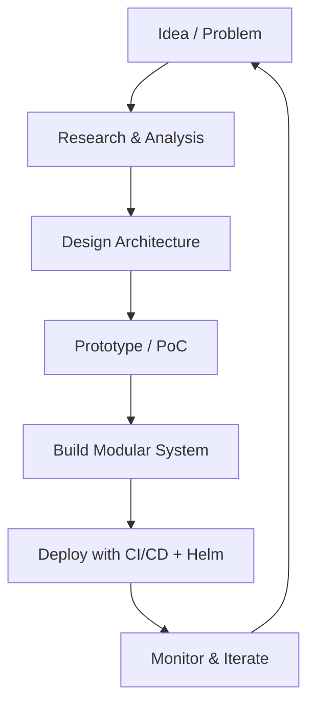

# Hi there, I'm Riadizur 👋

Welcome to my GitHub profile!

🚀 I'm a digital tech consultant and builder at **Eltronesia Tech Consulting**, where we specialize in:
- Agentic AI & LLMs
- Big Data & Automation
- Robotics & System Integration
- Custom Software Development
- Digital Transformation Consulting

🎯 My current focus:
- Building modular, scalable **RAG pipelines** with Milvus, FAISS, FastAPI, and SharePoint integration
- Deploying production-grade apps using **Helm**, **Terraform**, **AKS**, and **CI/CD pipelines**
- Exploring the **Model-Context-Protocol (MCP)** architecture in real-world systems

🛠️ Tech Stack & Tools:
`Python` `FastAPI` `LangChain` `FAISS` `Milvus` `Gradio` `Streamlit`  
`Docker` `Kubernetes` `Helm` `Terraform` `Azure`  
`GitLab CI/CD` `PostgreSQL` `LLMs (OpenAI, Claude, etc)`

## 🧠 My Current Workflow

📚 Passionate about:
- Solving real-world problems through tech
- Enabling smarter decisions with automation and data
- Bridging research and practical application in Indonesia’s healthtech & public service domains

📩 Let's connect!
- 🌐 [eltronesia.com](https://eltronesia.com) *(coming soon)*
- 💼 [LinkedIn](https://linkedin.com/in/riadizur) *(update if needed)*
- 📝 [Medium Blog](https://medium.com/@riadizur) *(optional)*

> "We protect what matters most." – a vision inspired by care, technology, and purpose.

Thanks for stopping by! 🌟
